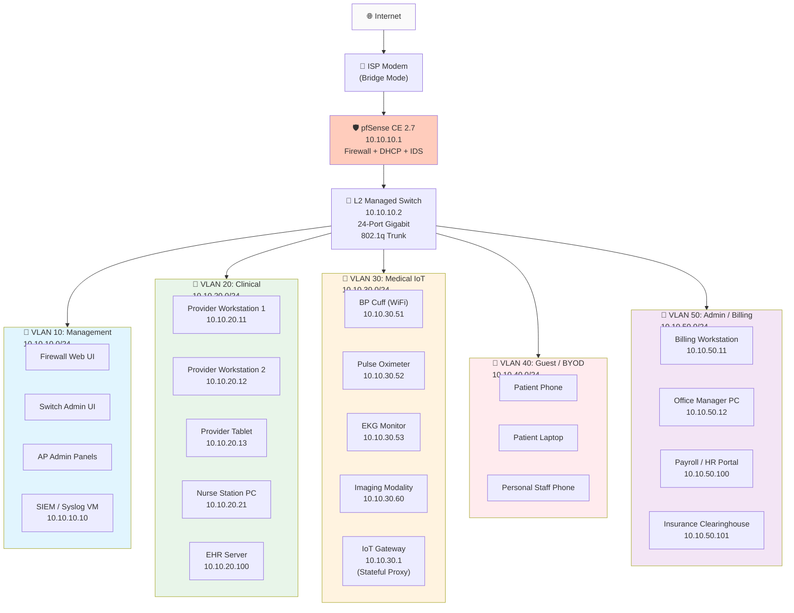

# Network Topology Diagrams

## Logical Overview

```
┌─────────────────────────────────────────────────────────────────┐
│                         INTERNET                                 │
└────────────────────┬──────────────────────────────────────────────┘
                     │
              ┌──────▼──────┐
              │   ISP Modem  │
              │  (Bridge Mode)│
              └──────┬──────┘
                     │
              ┌──────▼──────┐
              │   pfSense    │  ← Firewall / Router / DHCP / IDS
              │    CE 2.7    │     5 VLAN interfaces + WAN
              │  10.10.10.1  │
              └──────┬──────┘
                     │
              ┌──────▼──────┐
              │  L2 Managed  │  ← VLAN trunk (802.1q)
              │    Switch     │     24-port Gigabit
              │  10.10.10.2  │
              └──────┬──────┘
                     │
      ┌──────────────┼──────────────┬──────────────┐
      │              │              │              │
  ┌───▼───┐    ┌────▼────┐   ┌────▼────┐   ┌────▼────┐
  │  AP-1  │    │  AP-2   │   │  AP-3   │   │ Server  │
  │Guest/BYOD│   │Clinical │   │ Medical │   │  Rack   │
  │ VLAN 40 │    │ VLAN 20 │   │ IoT VLAN│   │VLAN 10/20│
  │ 2.4+5GHz│    │ 5GHz only│   │ 2.4GHz  │   │         │
  └─────────┘    └─────────┘   └─────────┘   └─────────┘
```

## Detailed Mermaid Diagram



## Physical Layout (Clinic Floor Plan Reference)

```
┌─────────────────────────────────────────────────────────────┐
│                    VALLEY VIEW FAMILY MEDICINE                 │
│                         (3,200 sq ft)                          │
├─────────────────────────────────────────────────────────────┤
│                                                               │
│   ┌─────────┐    ┌─────────┐    ┌─────────┐    ┌─────────┐   │
│   │ Exam 1  │    │ Exam 2  │    │ Exam 3  │    │  Lab   │   │
│   │(VLAN 20)│    │(VLAN 20)│    │(VLAN 20)│    │(VLAN 30)│   │
│   │ BP, OX  │    │ BP, OX  │    │ BP, OX  │    │ Imaging│   │
│   └────┬────┘    └────┬────┘    └────┬────┘    └────┬────┘   │
│        │              │              │              │         │
│        └──────────────┴──────────────┘              │         │
│                     │                              │         │
│   ┌──────────────────────────────────────────────────────┐  │
│   │              HALLWAY (AP-2: Clinical 5GHz)              │  │
│   │                    + AP-3: Medical IoT                  │  │
│   └──────────────────────────────────────────────────────┘  │
│        │              │              │              │         │
│   ┌────▼────┐    ┌────▼────┐    ┌────▼────┐    ┌────▼────┐   │
│   │Nurse Stn│    │ Provider│    │Provider │    │Provider │   │
│   │(VLAN 20)│    │ Office 1│    │ Office 2│    │ Office 3│   │
│   │         │    │(VLAN 20)│    │(VLAN 20)│    │(VLAN 20)│   │
│   └─────────┘    └─────────┘    └─────────┘    └─────────┘   │
│                                                               │
│   ┌──────────────────────────────────────────────────────┐    │
│   │              WAITING ROOM / RECEPTION                  │    │
│   │          (AP-1: Guest/BYOD 2.4GHz + 5GHz)            │    │
│   │                                                        │    │
│   │   [Front Desk] ──(VLAN 20 + VLAN 50 shared jack)───  │    │
│   │                                                        │    │
│   └──────────────────────────────────────────────────────┘    │
│                                                               │
│   ┌──────────────────┐      ┌──────────────────────────────┐ │
│   │   ADMIN OFFICE   │      │      SERVER / IT CLOSET      │ │
│   │  (VLAN 50 only)  │      │   (VLAN 10 + Mgmt Switch)  │ │
│   │  Billing + HR    │      │   Firewall + SIEM + Rack     │ │
│   └──────────────────┘      └──────────────────────────────┘ │
│                                                               │
└─────────────────────────────────────────────────────────────┘
```

## Traffic Flow Summary

| Source Zone | Destination Zone | Allowed? | Path / Justification |
|-------------|-----------------|----------|---------------------|
| Clinical (20) | EHR Server (20) | ✅ Yes | Direct L2 within VLAN — no firewall traversal needed |
| Clinical (20) | Medical IoT (30) | ✅ Yes | tcp/443 only to IoT Gateway (10.10.30.1) for device data ingest |
| Medical IoT (30) | Clinical (20) | ❌ No | Devices are data producers, not consumers. Prevents lateral movement. |
| Guest (40) | Any internal RFC1918 | ❌ No | Internet-only. DNS + DHCP only. |
| Admin (50) | EHR Server (20) | ✅ Yes | tcp/443 via firewall + bastion jump host. RBAC enforced at EHR app layer. |
| Any | Management (10) | ❌ No | Mgmt VLAN is "out of band" — physical switchport access only. |
| All zones | Internet | ✅ Yes | NAT + stateful inspection. Egress filtering applies (see firewall-rules.md). |

## Key Design Decisions

1. **Medical IoT Gateway (10.10.30.1)** — Not a router; a **stateful application-layer proxy**. IoT devices push data to the gateway over mTLS. The gateway forwards aggregated, normalized data to the EHR server. Devices never initiate sessions directly to VLAN 20.

2. **Management VLAN is "air-gapped" logically** — No routing from any user VLAN into VLAN 10. Administrative access requires physically plugging into a dedicated switchport or connecting via a VPN concentrator on a separate interface.

3. **Front Desk Dual-VLAN** — The front-desk jack is an **802.1x port** with dynamic VLAN assignment. If the device authenticates as a domain-joined clinical workstation → VLAN 20. If unknown/unauthenticated → VLAN 40 (guest). Prevents accidental clinical data leakage from personal devices.
