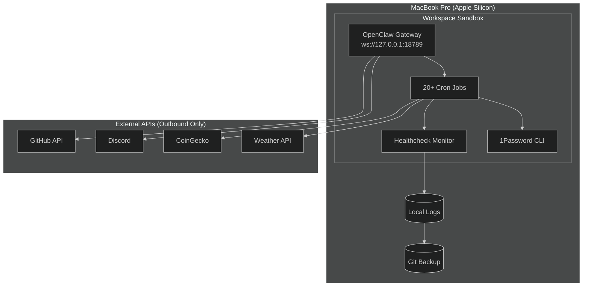

# OpenClaw Home Lab

> A self-hosted AI automation & security monitoring lab running on macOS Apple Silicon, built to demonstrate SOC-analyst and security-engineer competencies through real-world automation, logging, hardening, and incident detection.

## Overview

This project documents a production-like security home lab running entirely on a single MacBook Pro (Apple Silicon). The lab hosts the [OpenClaw](https://github.com/openclaw/openclaw) AI gateway, 20+ automated cron jobs, health-data pipelines, cryptocurrency monitoring, research ingestion, and multi-channel alerting — all while enforcing data-privacy, least-privilege, and synthetic-data policies.

**Why this matters for cybersecurity hiring managers:** Vincent Phan (the author) is a Certified Pharmacy Technician (CPhT) with four years of HIPAA-regulated PHI handling experience, now transferring into a BS Information Systems — Cybersecurity concentration at CSU San Bernardino. This lab bridges that gap: it shows hands-on systems administration, log analysis, threat detection, secret management, and incident response on a platform he actually operates daily.

## What This Demonstrates

| Competency | Evidence in This Repo |
|-----------|----------------------|
| **System Monitoring & Health Checks** | [`scripts/healthcheck.py`](scripts/healthcheck.py) — automated service-status, disk, memory, and cron-failure detection |
| **Log Analysis & Anomaly Detection** | [`data/sample-logs.json`](data/sample-logs.json) + [`config/monitoring-rules.yaml`](config/monitoring-rules.yaml) — structured ingestion and alerting rules |
| **Secret Management & Least Privilege** | [`scripts/secrets-audit.py`](scripts/secrets-audit.py) + 1Password CLI integration, environment-variable isolation |
| **Threat Detection & Incident Response** | [`docs/threat-model.md`](docs/threat-model.md) — documented prompt-injection defense, anomaly escalation, and response playbook |
| **Network Hardening & Segmentation** | [`docs/network-setup.md`](docs/network-setup.md) — loopback-only gateway, outbound-only external API access, no exposed ports |
| **Automation & Scripting** | Python/Bash health checks, backup scripts, cron orchestration |
| **Documentation & Reporting** | Architecture diagrams, threat model, hardening checklist, lessons learned |

## Architecture

See [`docs/architecture.md`](docs/architecture.md) for the full system diagram and component breakdown.



## How to Run

### Prerequisites

- macOS 14+ (Apple Silicon)
- Python 3.11+
- OpenClaw gateway installed (`openclaw` CLI)
- 1Password CLI (`op`) configured for secret injection

### Health Check

```bash
# Run the automated health check (synthetic data for demo)
python3 scripts/healthcheck.py --demo

# Audit workspace for hardcoded secrets (safe — only synthetic samples)
python3 scripts/secrets-audit.py --workspace ./
```

### Backup Verification

```bash
# Simulate a config backup (dry-run, safe)
bash scripts/backup.sh --dry-run
```

### Tests

```bash
pip install pytest && pytest tests/ -v
```

The secrets scanner redacts every match (4-character prefix + length) so its own report can never leak a credential.

## Threat Model & Security Rationale

See [`docs/threat-model.md`](docs/threat-model.md) for a full STRIDE analysis. Key points:

- **Spoofing/Tampering:** All external API calls use injected tokens (1Password) — never hardcoded.
- **Repudiation:** Git-backed audit trail for config changes; structured JSON logs with timestamps.
- **Information Disclosure:** Workspace sandbox prevents filesystem escape; synthetic data used for all health/nutrition demos.
- **Denial of Service:** Resource-guard rules (disk >90%, memory >85%) trigger alerts before exhaustion.
- **Elevation of Privilege:** Gateway runs unprivileged; no root-required scripts in automation path.

## Skills Demonstrated

This project maps directly to entry-level SOC / security-engineer job requirements:

1. **SIEM-like Monitoring:** Custom Python health checker aggregates service status, resource utilization, and cron anomalies into a single JSON report — the same pattern used by Splunk/Wazuh agents.
2. **Log Analysis:** `sample-logs.json` demonstrates filtering cron failures, authentication anomalies, and resource thresholds.
3. **Threat Detection:** Documented prompt-injection attack (May 2026) and defense — real incident response with post-mortem.
4. **Secret Hygiene:** 1Password CLI injection, environment-variable scoping, and automated secrets-audit scanning.
5. **Network Security:** Loopback-only gateway, no inbound ports, outbound-only API architecture.
6. **Documentation:** Architecture diagrams, runbooks, and a hardening checklist suitable for onboarding a new analyst.

## Honest Scope Notes

- **Single-host lab:** No multi-node Kubernetes cluster, no enterprise IDS. This is a *student-grade* lab scaled to one laptop — deliberately honest about scope.
- **Synthetic data only:** All health, nutrition, and financial logs in `/data/` are fabricated. No real PHI, no real wallet addresses, no real API keys.
- **Gateway dependency:** Some scripts reference OpenClaw-specific paths (`~/.openclaw/workspace/`). They are portable enough to adapt to any Linux/macOS home directory.
- **Not a production SOC:** This demonstrates *competencies*, not a Fortune-500 replacement. A hiring manager should see potential, not overclaiming.

## Project Structure

```
openclaw-home-lab/
├── README.md                      # This file
├── docs/
│   ├── architecture.md            # Mermaid diagrams + component deep-dive
│   ├── threat-model.md            # STRIDE analysis + incident response
│   ├── network-setup.md           # Loopback-only + firewall rules
│   ├── hardening-checklist.md     # macOS hardening steps applied
│   └── lessons-learned.md         # Failures, pivots, and what worked
├── scripts/
│   ├── healthcheck.py             # System health + service status
│   ├── secrets-audit.py           # Hardcoded-secret scanner
│   ├── log-rotate.sh              # Log archival + compression
│   ├── network-scan.sh            # Firewall state + listening-port audit (read-only)
│   └── backup.sh                  # Git-based config backup
├── tests/                         # pytest: secret detection + redaction, health thresholds
├── config/
│   ├── services.yaml              # Service definitions + ports
│   └── monitoring-rules.yaml      # Alert thresholds + conditions
├── data/
│   └── sample-logs.json           # Synthetic log entries for analysis
└── diagrams/
    └── architecture.mmd           # Mermaid source (included in docs)
```

## License

MIT — feel free to fork and adapt for your own portfolio. If you reuse the threat-model format, a citation is appreciated.
