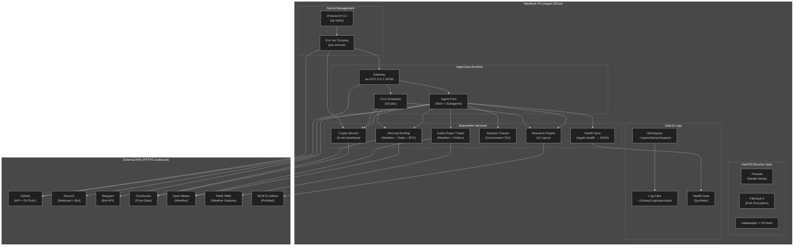

# Architecture

## System Overview

The OpenClaw Home Lab is a single-host architecture designed to maximize learning while minimizing attack surface. Every component runs on a MacBook Pro (Apple Silicon, M-series) with macOS 26.x. The design philosophy is **loopback-first, outbound-only, least-privilege**.

## Component Diagram



## Key Design Decisions

### 1. Loopback-Only Gateway

The OpenClaw gateway binds exclusively to `ws://127.0.0.1:18789`. There is **no 0.0.0.0 binding**, no reverse proxy, and no inbound port forwarding. This means:

- **No remote exploitation path** to the gateway from the internet.
- All agent-to-gateway communication is intra-host.
- External integrations (Discord, Telegram) use outbound HTTPS APIs, not inbound webhooks.

### 2. Workspace Sandboxing

OpenClaw enforces a workspace sandbox restricting file I/O to `~/.openclaw/workspace/`. Outside of explicit `exec` calls, agents cannot read arbitrary user files. This is a **defense-in-depth** measure: even if an agent prompt were injected with malicious file-access instructions, the runtime blocks escape.

### 3. Secret Injection via 1Password

No API keys, tokens, or passwords are stored in the workspace git repository. The 1Password CLI (`op inject`) substitutes secrets at runtime into environment variables or temporary config files. Example:

```bash
# In a cron job or script
export KALSHI_API_KEY=$(op read "op://Private/Kalshi API Credentials/api_key")
export BEEHIIV_API_KEY=$(op read "op://Private/beehiiv API Credential/credential")
```

This pattern ensures:
- **No secrets in shell history** (command is `op read`, not `echo $SECRET`).
- **No secrets in git** (`.gitignore` covers `*.pem`, `.env`, `config.yaml` with keys).
- **Rotatable without code changes** — update 1Password, no redeploy.

### 4. Cron Job Isolation

The 29 cron jobs are categorized by session target:

| Target | Count | Risk Profile |
|--------|-------|-------------|
| `main` (systemEvent) | 3 | Low — simple text injection |
| `isolated` (agentTurn) | 20 | Medium — fresh subagent per run, self-cleaning |
| `current` (agentTurn) | 2 | Medium — binds to active session |
| `session:<id>` | 4 | Medium — named persistent sessions |

Isolated subagents are the default for complex tasks. They spawn fresh, run with a clean context, and are destroyed after completion. This limits the blast radius of a misbehaving automation.

### 5. Data Classification

| Classification | Examples | Handling |
|----------------|----------|----------|
| **Public** | OpenClaw docs, GitHub repo metadata, Discord channel IDs | Stored in workspace, committed to git |
| **Internal** | Config files, cron schedules, automation scripts | Stored in workspace, committed to git |
| **Sensitive** | Health metrics, nutrition logs, financial data | **Synthetic-only** in this repo; real data lives in encrypted Apple Health / Cronometer |
| **Secret** | API keys, passwords, private keys | **Never in repo**; 1Password-only |

## Resource Footprint

The lab runs comfortably within a single laptop's resources:

| Resource | Typical Usage | Peak (Research Swarm) |
|----------|--------------|---------------------|
| CPU | 5-15% | 40-60% (parallel subagents) |
| Memory | 2-4 GB | 8-12 GB (large model loads) |
| Disk (workspace) | ~500 MB | ~2 GB (health export, logs) |
| Network | ~50 MB/day | ~200 MB/day (research + crypto) |

## Failure Modes

| Failure | Detection | Mitigation |
|---------|-----------|------------|
| Gateway restart during subagent run | Subagent completion event dropped | Self-wake cron + heartbeat polling (see `HEARTBEAT.md`) |
| Cron job hangs | `timeoutSeconds` configured per job | Automatic kill after timeout |
| API rate limit (CoinGecko) | 429 response | 30-minute cooldown + alert to `#bot-status` |
| Disk full | `healthcheck.py` monitors >90% | Alert + log rotation script |
| Model provider outage | Fallback model cascade (Haiku → Opus → Kimi) | Automatic retry with alternate provider |

## Future Evolution (Honest Roadmap)

- **Linux VM or Raspberry Pi:** Offload the gateway to a dedicated low-power host for 24/7 uptime.
- **Containerization:** Dockerize the research engine and crypto monitor for reproducible deploys.
- **Centralized Logging:** Ship JSON logs to a free-tier cloud SIEM (e.g., Splunk Free, Elastic OSS) for cross-correlation practice.
- **IDS Simulation:** Run Suricata in a VM with a mirrored port to analyze automation traffic patterns.

These are *aspirational* — documented here to show the author understands what comes next.
