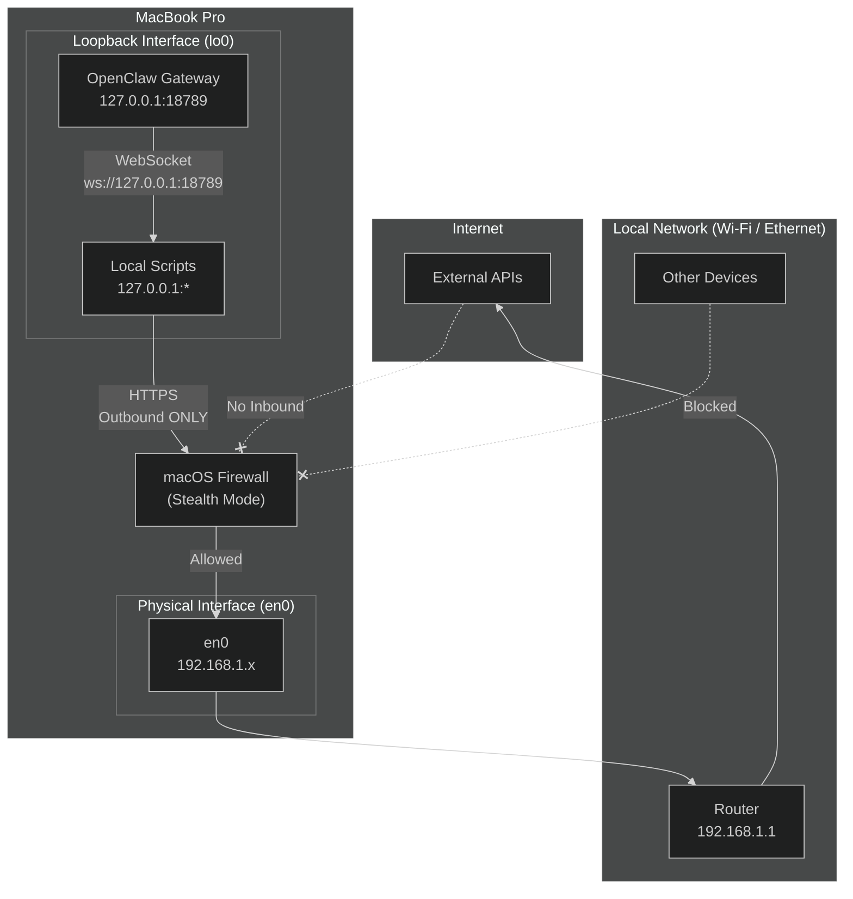

# Network Setup

## Design Principle: Loopback-First, Outbound-Only

The OpenClaw Home Lab does not expose any services to the local network or internet. All communication is either intra-host (loopback) or outbound HTTPS to external APIs. This eliminates the vast majority of network-based attack vectors.

## Network Diagram



## Interface Configuration

### Loopback (`lo0`)

```
lo0: flags=8049<UP,LOOPBACK,RUNNING,MULTICAST> mtu 16384
	inet 127.0.0.1 netmask 0xff000000
```

- **OpenClaw Gateway:** `ws://127.0.0.1:18789`
- **Local script APIs:** Ephemeral high ports (`127.0.0.1:5000+`) for inter-script communication
- **Scope:** Intra-host only; no packet leaves the loopback interface

### Physical (`en0` — Wi-Fi or Ethernet)

```
en0: flags=8863<UP,BROADCAST,SMART,RUNNING,SIMPLEX,MULTICAST> mtu 1500
	inet 192.168.1.42 netmask 0xffffff00 broadcast 192.168.1.255
```

- **DHCP-assigned:** Dynamic IP via router
- **Firewall:** macOS Application Firewall enabled; Stealth Mode on
- **No port forwarding:** Router has no rules forwarding inbound traffic to `192.168.1.42`

## macOS Firewall Rules

The built-in firewall is configured via System Settings → Network → Firewall:

| Setting | Value | Rationale |
|---------|-------|-----------|
| **Firewall** | On | Blocks unsolicited inbound connections |
| **Stealth Mode** | On | Host does not respond to ICMP ping or port scans |
| **Block All Incoming Connections** | Off | Required for legitimate outbound-initiated HTTPS (stateful) |
| **Automatically allow signed software** | Off | Manual approval for new applications |

### Verification

```bash
# Check firewall status
sudo /usr/libexec/ApplicationFirewall/socketfilterfw --getglobalstate
# Expected: Firewall is enabled. (1 = enabled)

# Check stealth mode
sudo /usr/libexec/ApplicationFirewall/socketfilterfw --getstealthmode
# Expected: Stealth mode enabled
```

## External API Communication

All external communication uses **outbound HTTPS** initiated by the host:

| Service | Destination | Protocol | Data Type |
|---------|-------------|----------|-----------|
| GitHub API | `api.github.com:443` | HTTPS | Repo metadata, issues |
| Discord | `discord.com:443` | HTTPS | Bot messages, webhooks |
| Telegram | `api.telegram.org:443` | HTTPS | Bot messages |
| CoinGecko | `api.coingecko.com:443` | HTTPS | Price data |
| Open-Meteo | `api.open-meteo.com:443` | HTTPS | Weather forecasts |
| NWS NBM | `api.weather.gov:443` | HTTPS | Weather station data |
| NCBI | `eutils.ncbi.nlm.nih.gov:443` | HTTPS | PubMed search |
| 1Password | `*.1password.com:443` | HTTPS | Secret retrieval |

### No Inbound Webhooks

Unlike typical bot architectures that listen for webhooks, this lab **polls or pushes outbound only**:

- **Discord:** Messages sent via REST API (`POST /channels/{id}/messages`), not received via Gateway websocket.
- **Crypto:** Price checks initiated by cron, not pushed by exchange.
- **Research:** PubMed queries initiated by script, not fed by alert.

This means:
- No need to expose a public IP or DDNS.
- No TLS certificate management for inbound connections.
- No DDoS surface from inbound flood.

## DNS & Privacy

| Setting | Value | Rationale |
|---------|-------|-----------|
| **DNS Servers** | Router default (192.168.1.1) → ISP DNS | Could harden with Cloudflare `1.1.1.1` or Quad9 `9.9.9.9` |
| **DNS over HTTPS (DoH)** | Not enabled | macOS 26 supports it; candidate for future hardening |
| **mDNS (Bonjour)** | Enabled | Local service discovery; limited to LAN segment |

## Future Hardening

1. **VPN for API traffic:** Route all external API calls through a trusted VPN to prevent ISP-level traffic analysis.
2. **Pi-hole or NextDNS:** Block advertising/tracking domains at the network level; reduces telemetry leakage.
3. **Network segmentation:** If adding IoT devices (Hue lights, etc.), place them on a VLAN isolated from the laptop's primary network.
4. **Inbound SSH:** Currently disabled. If ever enabled, restrict to key-only auth, non-standard port, and `AllowUsers` whitelist.

## Verification Script

See [`scripts/network-scan.sh`](../scripts/network-scan.sh) for an automated check of open ports and firewall status.
